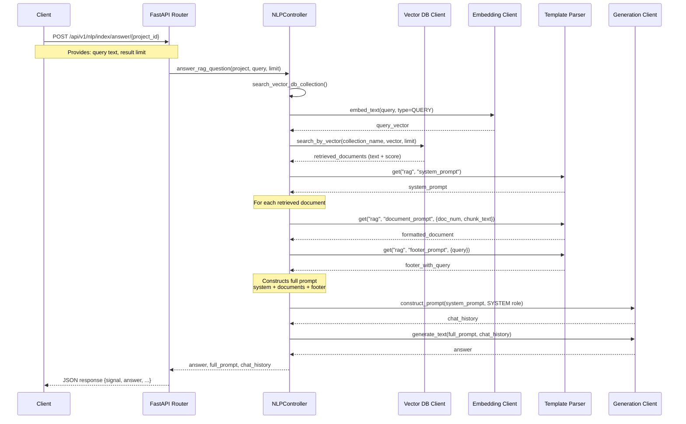

# RAG (Retrieval-Augmented Generation) Sequence Diagram

This diagram illustrates the sequence of operations for the RAG workflow, showing how components interact from the API request to the generated answer.

## RAG Flow Components

The RAG (Retrieval-Augmented Generation) process implemented in mini-rag involves the following key components:

1. **API Layer (FastAPI Router)**:

   - Receives and validates the user's request
   - Orchestrates the workflow via the NLPController

2. **NLP Controller**:

   - Coordinates the entire RAG pipeline
   - Manages interaction between components
   - Performs the three core RAG phases:
     - Retrieval
     - Augmentation
     - Generation

3. **Vector Database Client**:

   - Stores document embeddings
   - Performs efficient vector similarity search
   - Returns the most relevant documents for a query

4. **Embedding Client**:

   - Converts text (queries and documents) into vector embeddings
   - Enables semantic search through vector similarity

5. **Template Parser**:

   - Loads and formats prompt templates
   - Supports multiple languages
   - Structures the LLM interaction consistently

6. **LLM Generation Client**:
   - Processes the augmented prompt
   - Generates contextually informed answers

## Key Steps in Detail

1. **Vector Search**:

   - Query is embedded into a vector
   - Similar document vectors are retrieved
   - Results are ranked by relevance (cosine similarity)

2. **Prompt Construction**:

   - System prompt provides instructions to the LLM
   - Retrieved documents are formatted with metadata
   - Query is included in the footer
   - All components are combined into a structured prompt

3. **Answer Generation**:
   - Prompt is sent to the LLM
   - LLM generates a response based on the retrieved context
   - Answer is returned to the client
