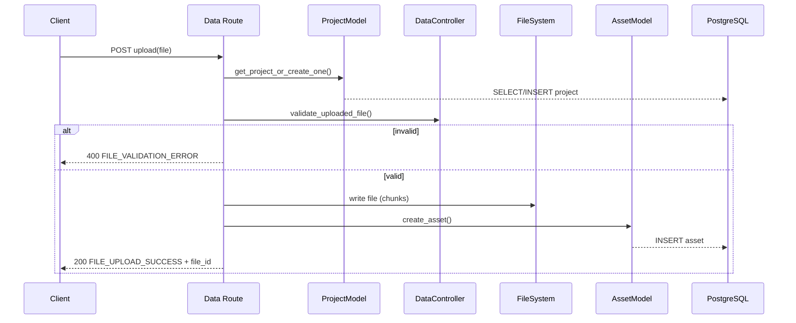
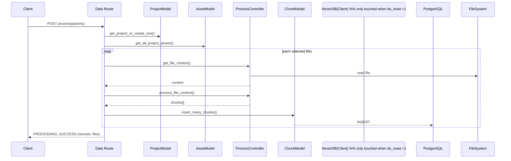
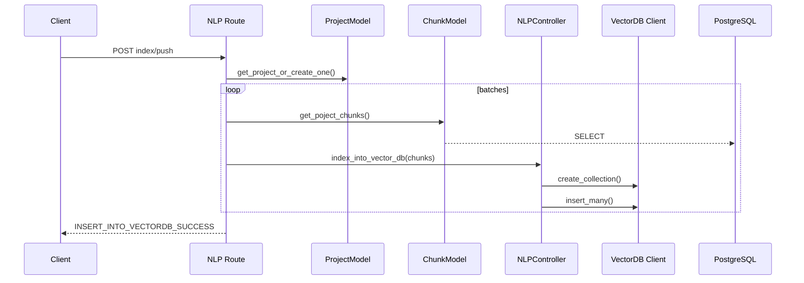
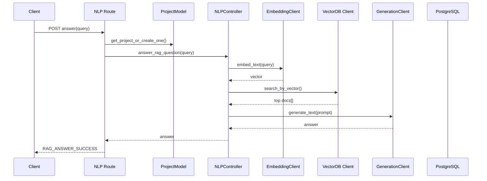
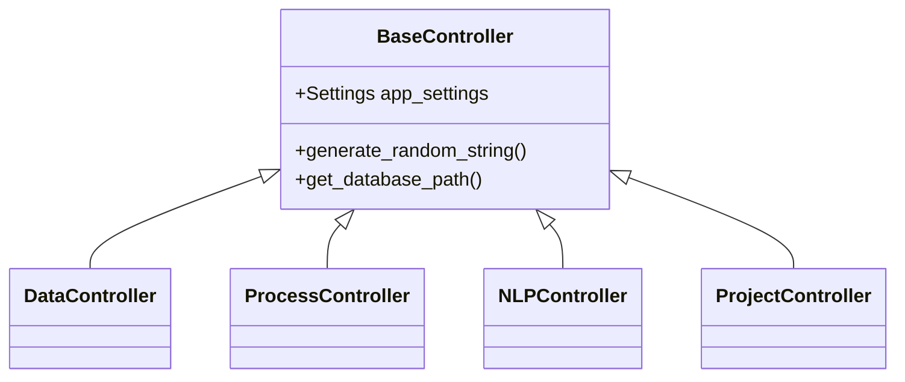
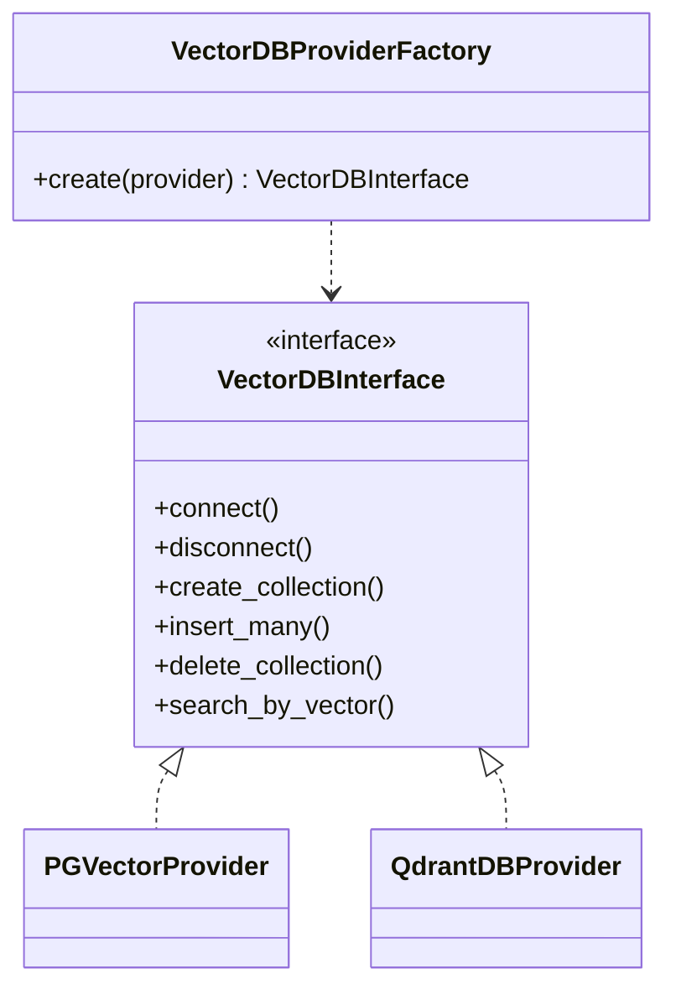
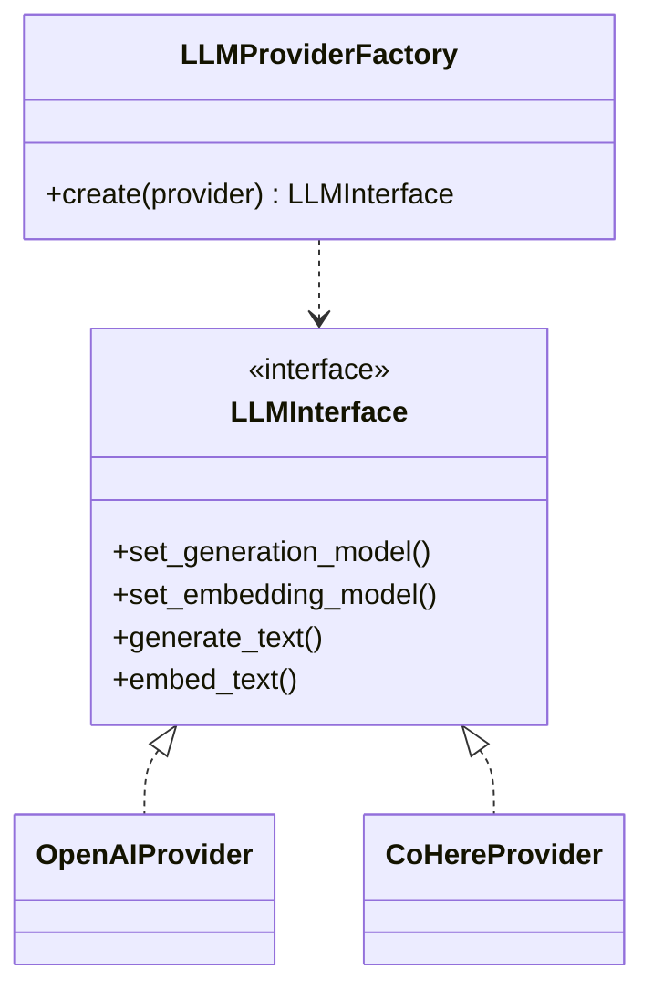
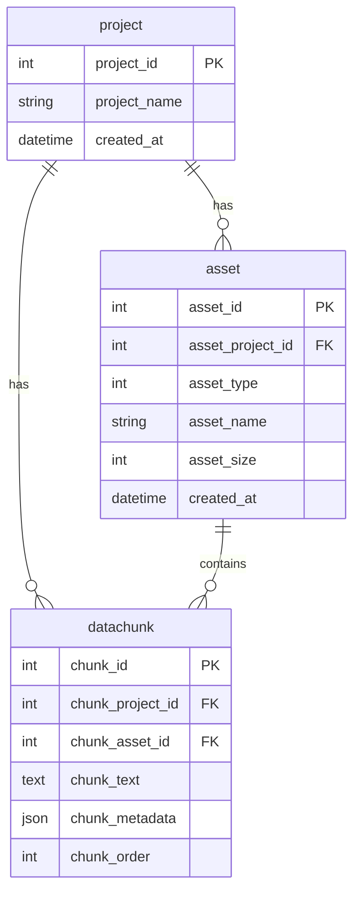

----------------------------------------------------
1. Layered / Component View
----------------------------------------------------
```mermaid
graph LR
  subgraph Presentation-Layer
      FAPI[FastAPI routes\n(base.py, data.py, nlp.py)]
  end
  subgraph Application-Layer
      Ctrls[Controllers\n(Data, Process, NLP, Project, …)]
  end
  subgraph Domain-Layer
      Models[Domain Models\n(ProjectModel, AssetModel, ChunkModel)]
  end
  subgraph Infrastructure-Layer
      Stores[Stores\n(VectorDB, LLM, DB)]
  end
  subgraph External-Services
      PG[(PostgreSQL)]
      PGVec[(PGVector)]
      Qdrant[(Qdrant)]
      OpenAI[(OpenAI)]
      CoHere[(CoHere)]
  end

  FAPI --> Ctrls
  Ctrls --> Models
  Ctrls --> Stores
  Models --> PG
  Stores --> PGVec & Qdrant
  Stores --> OpenAI & CoHere
```

----------------------------------------------------
2. Sequence – File Upload (`/api/v1/data/upload/{project_id}`)
----------------------------------------------------


----------------------------------------------------
3. Sequence – File Processing (`/api/v1/data/process/{project_id}`)
----------------------------------------------------


----------------------------------------------------
4. Sequence – Vector Index Push (`/api/v1/nlp/index/push/{project_id}`)
----------------------------------------------------


----------------------------------------------------
5. Sequence – RAG Answer (`/api/v1/nlp/index/answer/{project_id}`)
----------------------------------------------------


----------------------------------------------------
6. Class Diagram – Controllers Hierarchy
----------------------------------------------------


----------------------------------------------------
7. Class Diagram – Vector DB Abstraction
----------------------------------------------------


----------------------------------------------------
8. Class Diagram – LLM Abstraction
----------------------------------------------------


----------------------------------------------------
9. ER Diagram – Database Schemes
----------------------------------------------------


----------------------------------------------------
10. Activity Diagram – Simple Chunk Splitter
----------------------------------------------------
```mermaid
flowchart TD
    A[process_simpler_splitter()] --> B{Join all texts}
    B --> C[Split by delimiter]
    C --> D[Accumulate lines\n until >= chunk_size]
    D -->|yes| E[Push chunk to list]
    D -->|no| C
    E --> C
    C -->|EOF| F[Push last chunk]
    F --> G[Return chunks[]]

